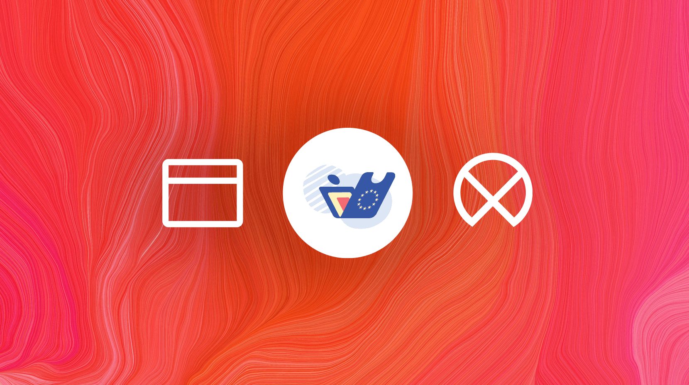

# EUDIW🇪🇺🇱🇻: Self-Service Portal

This is a self-service portal that provides means to create a new user profile and generate QR codes for adding Latvian PID and other attributes for **NOBID [EUDIW](https://ec.europa.eu/digital-building-blocks/sites/display/EUDIGITALIDENTITYWALLET/EU+Digital+Identity+Wallet+Home)** apps for.

Built with the [LX/UI platform](https://github.com/wntrtech/lx-ui) and [Vue.js 3](https://vuejs.org) for fast, consistent, and accessible user interfaces.


<!-- TOC -->

- [Portal-Selfservice](#repo_name_title)
  - [Development](#development)
  - [Requirements](#requirements)
  - [Customize configuration](#customize-configuration)
  - [:warning: IMPORTANT NOTES :warning:](#warning-important-notes-warning)
  - [Testing docker image locally](#testing-docker-image-locally)

<!-- /TOC -->

## Development

1. Build dev server:

    ```bash
    pnpm i
    ```

2. Run dev server (_also possible with vs code debug functionality (F5)_) :

    ```bash
    pnpm dev
    ```

## Requirements

- [Node.js](https://nodejs.org/en/) (at least v18.0.0)
- [PNPM](https://pnpm.io/) (at least v7.0.0 )
- [ni](https://github.com/antfu/ni) (optional - in order to use `ni` command instead of `pnpm`)

## Customize configuration

Environment variables are loaded from `.env` files in the root directory. See [Vite Environment Variables and Modes](https://vitejs.dev/guide/env-and-mode.html) for more information.

| Variable | Description | Default on serve (locally) | Default on build |
| --- | --- | --- | --- |
| `ENVIRONMENT` | Environment name | development | production |
| `BASE_PATH` | Base path of the application | / | / |
| `PUBLIC_URL` | Public URL of the application | <https://localhost:44341/> |  |
| `SERVICE_URL` | URL of the API service that your application will use | '' | /api |
| `AUTH_URL` | URL of the authentication service that your application will use | '' | /idauth |
| `CLIENT_ID` | `IDAuth` registrated client ID | portal-selfservice | portal-selfservice |

example .env file:

```sh
  environments:
    ENVIRONMENT: "production"
    BASE_PATH: "/"
    PUBLIC_URL: "https://edim-dev.example.lv/"
    SERVICE_URL: "https://edim-dev.example.lv/api/"
    AUTH_URL: "https://edim-dev.example.lv/idauth/"
    CLIENT_ID: ""
```

## :warning: IMPORTANT NOTES :warning:

It's **very important** that the webapp (this portal) can be built and run locally as described below, with no extra steps:

- Clone this repo;
- Add `.env` file to my local project (see above);
- Run `pnpm i`;
- Press **F5** ("Run and Debug" in VSCode);
- Webapp starts in my local browser and can call published Dev API (without any CORS, HTTPS, Authentication redirect and/or other problems);

Other ways to run this webapp (e.g., connecting to locally run API, or connecting to test env, etc) are permitted, of course, but should be considered **additional** methods.

## Testing docker image locally

In order to test docker image locally (test if docker image is working as expected) run the following commands:

```bash
docker rmi portal-selfservice -f && docker rm portal-selfservice -f
pnpm run build
docker build -t portal-selfservice .
docker run -p 44342:8080 -e SERVICE_URL=https://service-dev.example.lv/api/1.0/ -e ENVIRONMENT=development -e PUBLIC_URL=http://localhost:44342/ -e USE_MOCK_MIDDLEWARE=true -e BASE_PATH=/ --name portal-selfservice portal-selfservice
```

after that you can open browser and go to <http://localhost:44341/> and see if the application is working as expected.

you should remember to comment out .env file in order to see how it works as close to production as possible.
